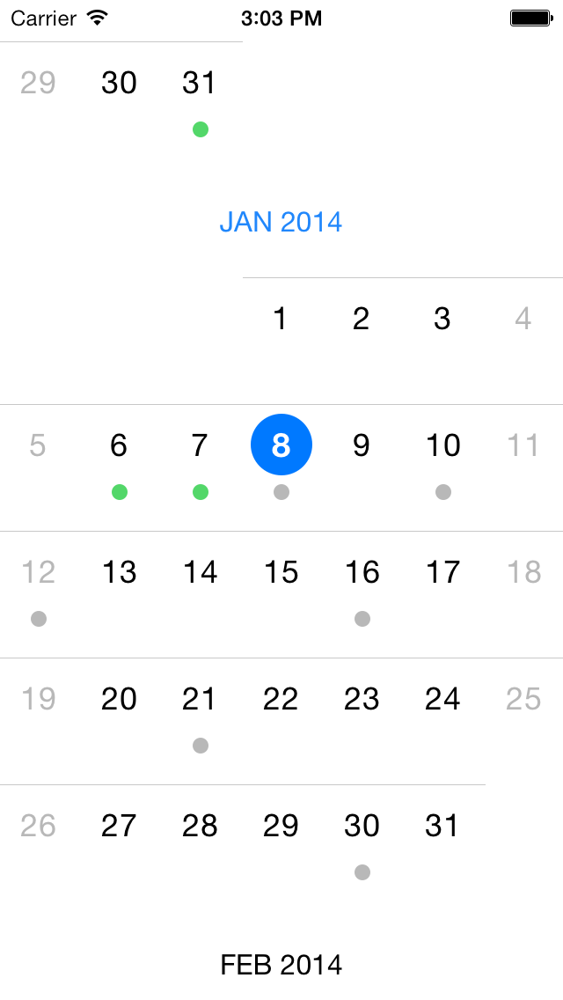

# RSDayFlow [](https://travis-ci.org/ruslanskorb/RSDayFlow)

<p align="center">
	
</p>

iOS 7 Calendar with Infinite Scrolling. Only need 4 lines of code to set up.

> [RSDayFlow](https://github.com/ruslanskorb/RSDayFlow) is a slim fork of [DayFlow](https://github.com/evadne/DayFlow) with updates and extensions:

> * Visual feedback of the currently selected cell
* Possibility to mark the date
* Design like iOS 7
* Much more updates

## Installation

[CocoaPods](http://cocoapods.org) is the recommended method of installing RSDayFlow. Simply add the following line to your `Podfile`:

#### Podfile

```ruby
pod 'RSDayFlow'
```

## Basic Usage

Import the class header.

``` objective-c
#import "RSDFDatePickerView.h"
```

Just create your date picker view and set a delegate / a data source if needed.

``` objective-c
- (void)viewDidLoad
{
	[super viewDidLoad];
	
	RSDFDatePickerView *datePickerView = [[RSDFDatePickerView alloc] initWithFrame:self.view.bounds];
	datePickerView.delegate = self;
    datePickerView.dataSource = self;
    [self.view addSubview:datePickerView];
}
```

## Delegate (optional)

`RSDFDatePickerView` provides three delegate methods. The method `datePickerView:shouldHighlightDate:` asks the delegate if the date should be highlighted during tracking. The method `datePickerView:shouldSelectDate:` asks the delegate if the specified date should be selected. The method `datePickerView:didSelectDate:` called when a user click on a specific date. To use them, implement the delegate in your view controller.

```objective-c
@interface ViewController () <RSDFDatePickerViewDelegate>
```

Then implement the delegate functions.

```objective-c
// Returns YES if the date should be highlighted or NO if it should not.
- (BOOL)datePickerView:(RSDFDatePickerView *)view shouldHighlightDate:(NSDate *)date
{
    return YES;
}

// Returns YES if the date should be selected or NO if it should not.
- (BOOL)datePickerView:(RSDFDatePickerView *)view shouldSelectDate:(NSDate *)date
{
    return YES;
}

// Prints out the selected date.
- (void)datePickerView:(RSDFDatePickerView *)view didSelectDate:(NSDate *)date
{
    NSLog(@"%@", [date description]);
}
```

## DataSource (optional)

`RSDFDatePickerView` provides three data source methods. The method `datePickerView:shouldMarkDate:` asks the data source if the date should be marked. The method `datePickerView:markImageColorForDate:` asks the data source about the color of the default mark image for the specified date. The method `datePickerView:markImageForDate:` asks the data source about the mark image for the specified date. The method `datePickerView:markImageColorForDate:` will be ignored if the method `datePickerView:markImageForDate:` is implemented. To use these methods, implement the data source in your view controller.

```objective-c
@interface ViewController () <RSDFDatePickerViewDataSource>
```

Then implement the data source functions.

```objective-c
// Returns YES if the date should be marked or NO if it should not.
- (BOOL)datePickerView:(RSDFDatePickerView *)view shouldMarkDate:(NSDate *)date
{
    // The date is an `NSDate` object without time components.
    // So, we need to use dates without time components.
    
    NSCalendar *calendar = [NSCalendar currentCalendar];
    unsigned unitFlags = NSYearCalendarUnit | NSMonthCalendarUnit |  NSDayCalendarUnit;
    NSDateComponents *todayComponents = [calendar components:unitFlags fromDate:[NSDate date]];
    NSDate *today = [calendar dateFromComponents:todayComponents];
    
    return [date isEqual:today];
}

// Returns the color of the default mark image for the specified date.
- (UIColor *)datePickerView:(RSDFDatePickerView *)view markImageColorForDate:(NSDate *)date
{
    if (arc4random() % 2 == 0) {
        return [UIColor grayColor];
    } else {
        return [UIColor greenColor];
    }
}

// Returns the mark image for the specified date.
- (UIImage *)datePickerView:(RSDFDatePickerView *)view markImageForDate:(NSDate *)date
{
    if (arc4random() % 2 == 0) {
        return [UIImage imageNamed:@"img_gray_mark"];
    } else {
        return [UIImage imageNamed:@"img_green_mark"];
    }
}
```

## Customization

Every view is customizable to fit your need.
Create a subclass of the desired view and override the default values.

## Coming Soon

- If you would like to request a new feature, feel free to raise as an issue.

## Demo

Build and run the `RSDayFlowExample` project in Xcode to see `RSDayFlow` in action.
Have fun. Make it faster. Fork and send pull requests. Figure out hooks for customization.


## Contact

Ruslan Skorb

- http://github.com/ruslanskorb
- http://twitter.com/ruslanskorb
- ruslan.skorb@gmail.com

## License

This project is is available under the MIT license. See the LICENSE file for more info. Attribution by linking to the [project page](https://github.com/ruslanskorb/RSDayFlow) is appreciated.
